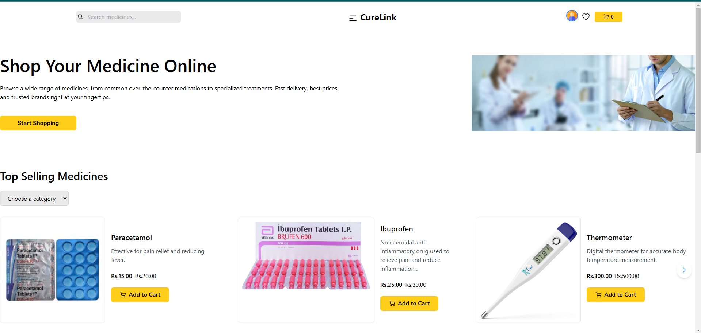
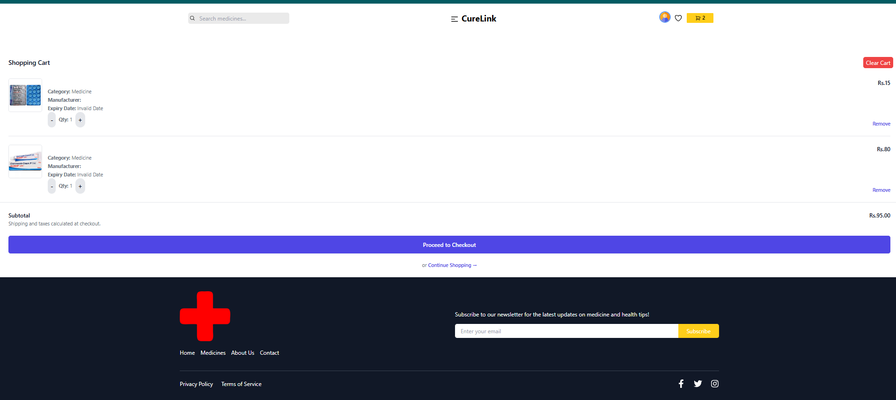

# CureLink - Medical Store App

CureLink is a comprehensive medical store application designed to make healthcare more accessible. With CureLink, users can:

- Buy medicines and healthcare products online.
- Book appointments with doctors.
- Manage medical records for admins.

## Features

### 🛒 Online Medicine Store

- Browse a wide range of medicines and healthcare products.
- Add items to your cart and complete purchases easily.

### 🩺 Doctor Appointment Booking

- Find and book appointments with verified doctors.
- View doctor profiles, availability, and patient reviews.

## Tech Stack

- **Frontend:** React, Redux
- **Backend:** Node.js, Express
- **Database:** MongoDB
- **Authentication:** JWT

## Installation

Follow these steps to set up CureLink locally:

1. Clone the repository:

   ```bash
   git clone https://github.com/yourusername/curelink.git
   ```

2. Install dependencies:

   ```bash
   npm install
   cd frontend
   npm install
   ```

3. Set up environment variables:
   Create a `.env` file in the root directory and add:

   ```env
   DB_URL=your-mongodb-connection-string
   JWT_SECRET_KEY=your-jwt-secret
   ```

4. Start the application in the frontend folder:
   ```bash
   npm run dev
   ```

### Homepage



### payment gateway



## Contributing

### Let's make healthcare more accessible, one click at a time!
